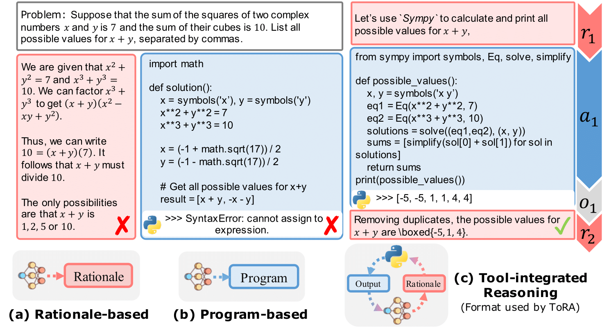

<h1 align="center">

<br>
ToRA: A Tool-Integrated Reasoning Agent
</h1>

<div align="center">


<br>
[](https://paperswithcode.com/sota/math-word-problem-solving-on-math?p=tora-a-tool-integrated-reasoning-agent-for)

</div>

<p align="center">
  <a href="https://microsoft.github.io/ToRA/"><b>[🌐 Website]</b></a> •
  <a href="https://arxiv.org/abs/2309.17452"><b>[📜 Paper]</b></a> •
  <a href="https://huggingface.co/llm-agents"><b>[🤗 HF Models]</b></a> •
  <a href="https://github.com/microsoft/ToRA"><b>[🐱 GitHub]</b></a>
  <!-- <a href="https://9557c5365a6f44dc84.gradio.live"><b>[🐯 Gradio Demo]</b></a> -->
  <br>
  <a href="https://twitter.com/zhs05232838/status/1708860992631763092"><b>[🐦 Twitter]</b></a> •
  <a href="https://www.reddit.com/r/LocalLLaMA/comments/1703k6d/tora_a_toolintegrated_reasoning_agent_for/"><b>[💬 Reddit]</b></a> •
  <a href="https://notes.aimodels.fyi/researchers-announce-tora-training-language-models-to-better-understand-math-using-external-tools/">[🍀 Unofficial Blog]</a>
  <!-- <a href="#-quick-start">Quick Start</a> • -->
  <!-- <a href="#%EF%B8%8F-citation">Citation</a> -->
</p>

<p align="center">
Repo for "<a href="https://arxiv.org/abs/2309.17452" target="_blank">ToRA: A Tool-Integrated Reasoning Agent for Mathematical Problem Solving</a>"
</p>

<p align="center">
    
        <br>
    <em>Figure 1: Comparing ToRA with baselines on LLaMA-2 base models from 7B to 70B.</em>
</p>


## 🔥 News

<!-- - [2023/10/13] 🔥🔥🔥 We release a demo for ToRA at [🐯 Gradio](https://9557c5365a6f44dc84.gradio.live), try it out!!! -->
- [2023/10/08] 🔥🔥🔥 All ToRA models released at [🤗 HuggingFace](https://huggingface.co/llm-agents)!
- [2023/09/29] ToRA paper, repo, and website released.

## 💡 Introduction

ToRA is a series of Tool-integrated Reasoning Agents designed to solve challenging mathematical reasoning problems by interacting with tools, e.g., computation libraries and symbolic solvers. ToRA series seamlessly integrate natural language reasoning with the utilization of external tools, thereby amalgamating the analytical prowess of language and the computational efficiency of external tools.

| Model | Size | GSM8k | MATH | AVG@10 math tasks<sup>&dagger;</sup> |
|---|---|---|---|---|
| GPT-4 | - | 92.0 | 42.5 | 78.3 |
| GPT-4 (PAL) | - | 94.2 | 51.8 | 86.4 |
| [ ToRA-7B](https://huggingface.co/llm-agents/tora-7b-v1.0) | 7B | 68.8 | 40.1 | 62.4|
| [ ToRA-Code-7B](https://huggingface.co/llm-agents/tora-code-7b-v1.0) | 7B | 72.6 | 44.6 | 66.5| 
| ToRA-Code-7B + self-consistency (k=50) | 7B | 76.8 | 52.5 | - |
| [ ToRA-13B](https://huggingface.co/llm-agents/tora-13b-v1.0) | 13B |  72.7 | 43.0 | 65.9|
| [ ToRA-Code-13B](https://huggingface.co/llm-agents/tora-code-13b-v1.0) | 13B | 75.8 | 48.1 | 71.3 |
| ToRA-Code-13B + self-consistency (k=50) | 13B | 80.4 | 55.1 | - |
| [ ToRA-Code-34B<sup>*</sup>](https://huggingface.co/llm-agents/tora-code-34b-v1.0) | 34B | 80.7 | **51.0** | 74.8 |
| ToRA-Code-34B + self-consistency (k=50) | 34B | 85.1 | <u>**60.0**</u> | - |
| [ ToRA-70B](https://huggingface.co/llm-agents/tora-70b-v1.0) | 70B | **84.3** | 49.7 | **76.9** |
| ToRA-70B + self-consistency (k=50) | 70B | <u>**88.3**</u> | 56.9 | - |

- <sup>*</sup>ToRA-Code-34B is currently the first and only open-source model to achieve over 50% accuracy (pass@1) on the MATH dataset, which significantly outperforms GPT-4’s CoT result (51.0 vs. 42.5), and is competitive with GPT-4 solving problems with programs. By open-sourcing our codes and models, we hope more breakthroughs will come!

- <sup>&dagger;</sup>10 math tasks include GSM8k, MATH, GSM-Hard, SVAMP, TabMWP, ASDiv, SingleEQ, SingleOP, AddSub, and MultiArith.
### Tool-Integrated Reasoning

<p align="center">
    
    <br>
    <em>Figure 2: A basic example of single-round tool interaction, which interleaves rationales with program-based tool use.</em>
</p>

### ToRA Training Pipeline

<p align="center">
    
    <br>
    <em>Figure 3: Training ToRA contains ① Imitation Learning, and ② output space shaping.</em>
</p>


## 🚀 Quick Start

### ⚙️ Setup

We recommend using [Conda](https://docs.conda.io/projects/miniconda) to manage your environment. We use [vLLM](https://github.com/vllm-project/vllm) (0.1.4) to accelerate inference. Run the following commands to setup your environment:

```sh
git clone https://github.com/microsoft/ToRA.git && cd ToRA/src
conda create -n tora python=3.10
conda activate tora
pip install torch==2.0.1 --index-url https://download.pytorch.org/whl/cu118 # CUDA 11.8 for example
pip install -r requirements.txt
```

### 🪁 Inference

We provide a script for inference, simply config the `MODEL_NAME_OR_PATH` and `DATA` in [src/scripts/infer.sh](/src/scripts/infer.sh) and run the following command:

```sh
bash scritps/infer.sh
```

We also open-source the [model outputs](/src/outputs/llm-agents/) from our best models (ToRA-Code-34B and ToRA-70B) in the `src/outputs/` folder.

### ⚖️ Evaluation

The [src/eval/grader.py](/src/eval/) file contains the grading logic that assesses the accuracy of the predicted answer by comparing it to the ground truth. This logic is developed based on the Hendrycks' MATH grading system, which we have manually verified on the MATH dataset to minimize false positives and false negatives.

To evaluate the predicted answer, run the following command:

```sh
python -m eval.evaluate \
    --data_name "math" \
    --prompt_type "tora" \
    --file_path "outputs/llm-agents/tora-code-34b-v1.0/math/test_tora_-1_seed0_t0.0_s0_e5000.jsonl" \
    --execute
```

then you will get:

```
Num samples: 5000
Num scores: 5000
Timeout samples: 0
Empty samples: 2
Mean score: [51.0]
Type scores: {'Algebra': 67.3, 'Counting & Probability': 42.2, 'Geometry': 26.1, 'Intermediate Algebra': 40.0, 'Number Theory': 59.3, 'Prealgebra': 63.8, 'Precalculus': 34.2}
```

### ⚡️ Training

We're currently undergoing an internal review to open-source the ToRA-Corpus-16k, stay tuned!
We also open-source our complete training scripts for the community, and you may construct your own dataset for training. We provide some example data in [data/tora/](/data/tora/).

To train a model, run the following command:

```sh
bash scripts/train.sh codellama 7b
```


## ☕️ Citation

If you find this repository helpful, please consider citing our paper:

```
@misc{gou2023tora,
      title={ToRA: A Tool-Integrated Reasoning Agent for Mathematical Problem Solving}, 
      author={Zhibin Gou and Zhihong Shao and Yeyun Gong and yelong shen and Yujiu Yang and Minlie Huang and Nan Duan and Weizhu Chen},
      year={2023},
      eprint={2309.17452},
      archivePrefix={arXiv},
      primaryClass={cs.CL}
}
```

## 🍀 Contributing

This project welcomes contributions and suggestions.  Most contributions require you to agree to a
Contributor License Agreement (CLA) declaring that you have the right to, and actually do, grant us
the rights to use your contribution. For details, visit https://cla.opensource.microsoft.com.

This project has adopted the [Microsoft Open Source Code of Conduct](https://opensource.microsoft.com/codeofconduct/).
For more information see the [Code of Conduct FAQ](https://opensource.microsoft.com/codeofconduct/faq/) or
contact [opencode@microsoft.com](mailto:opencode@microsoft.com) with any additional questions or comments.


## 🌟 Star History

[](https://star-history.com/#microsoft/ToRA&Date)
